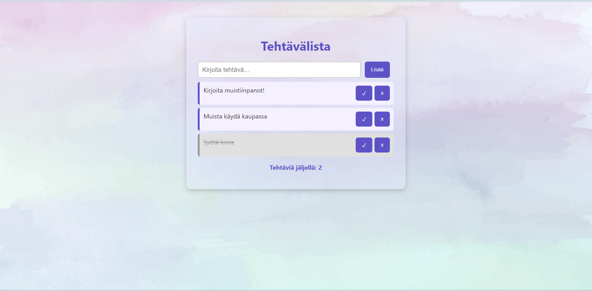

# Tehtävälista – DOM-skriptausprojekti

## 👤 Projektin nimi ja tekijät
**Tehtävälista**  
Tekijä: Tinja  
(Yksilötyö – ei parityötä)

---

## 🔗 Verkkolinkit
- **Julkaistu sovellus:** [Katso sovellus Netlifyssa](https://tehtavalistajava.netlify.app/)
- **Esittelyvideo:** [Katso demovideo Laurean videopalvelussa](https://google.com)
- **GitHub-repositorio:** [Avaa GitHub-projekti](https://github.com/pennanentinja/ToDo-java)

---

## 🤝 Työn jakautuminen
Tein tehtävän yksin, joten kaikki suunnittelut, toteutuksen, testauksen sekä dokumentoinnin tein itse. Työ eteni vaiheittain, suunnittelin ensin millaisen ulkoasun halua, ja pyysin tässä Microsoftin copilotilta apua. Sen jälkeen rupesin toteuttamaan toiminnallisuuksia sekä lopuksi sitten kaiken viimeistely. Vielä lopuksi lisäsin README:n.

---

## 📈 Oma arvio työstä ja oman osaamisen kehittymisestä
Onnistuin omasta mielestäni toteuttamaan vaaditut elementit ja toiminnallisuudet projektiin. Sovellus toimii mielestäni moitteettomasti sekä ulkoasu on kivan näköinen ja selkeä. Sovelluksesta ei mielestäni jäänyt uupumaan mitään oleellista. Mielestäni olen projektin aikana ol´ppinut paljon DOM-skriptauksesta sekä esimerkiksi localStoragen käytöstä vaikkei sitä kauheasti keretty vielä opettaa. 
**Antaisin itselleni pisteitä ehkä seuraavasti: 8/10 p**

---

## 🗣️ Palaute opettajalle kurssista sekä itse opetuksesta tähän saakka
Kurssi ja lähiopetustunnit ovat olleet mielestäni todella hyödyllisiä ja ovat auttaneet paljon ymmärtämään tätä uutta asiaa. Opetus on ollut todella selkeää ja opettajan apu ja palaute ovat auttaneet pääsemään eteenpäin. 

---

## 📚 Sisällysluettelo
- [Tietoja sovelluksesta](#tietoja-sovelluksesta)
- [Tunnetut virheet/bugit](#tunnetut-virheetbugit)
- [Kuvakaappaukset](#kuvakaappaukset)
- [Teknologiat](#teknologiat)
- [Asennus](#asennus)
- [Lähestymistapa](#lähestymistapa)
- [Kiitokset](#kiitokset)
- [Lisenssi](#lisenssi)

---

## 📦 Tietoja sovelluksesta
**Tehtävälista** on selainpohjainen sovellus, jossa käyttäjä voi lisätä tehtäviä, merkitä ne tehdyiksi, poistaa niitä ja seurata tehtävien määrää. Sovellus tallentaa tiedot localStorageen ja toimii täysin natiivilla JavaScriptillä.

---

## 🐞 Tunnetut virheet/bugit
Tällä hetkellä en ole huomannut että sovelluksessa olisi mitään bugeja tai virheitä jotka haittaisivat sovelluksen käyttöä. Testatut jutut toimivat odotetusti.

---

## 🖼️ Kuvakaappaukset
  
*Kuva: Tinja Pennanen*

---

## 🛠️ Teknologiat
Käytin seuraavia teknologioita:
- **HTML** – rakenteen luomiseen
- **CSS** – ulkoasun muotoiluun
- **JavaScript** – toiminnallisuuksien toteuttamiseen (DOM-skriptaus, validointi, localStorage)

---

## 🚀 Asennus
1. Lataa tai kloonaa repositorio GitHubista
2. Avaa `index.html` tiedosto selaimessa
3. Sovellus toimii suoraan ilman lisäasennuksia

---

## 🧭 Lähestymistapa
Toteutin sovelluksen vaiheittain:
- Suunnittelin käyttöliittymän ja värimaailman
- Toteutin lomakkeen ja listan DOM-skriptauksella
- Lisäsin validoinnin ja virheilmoitukset
- Tallensin tehtävät localStorageen
- Viimeistelin ulkoasun ja README.md-tiedoston

---

## 🙏 Kiitokset
- [MDN Web Docs – JavaScript DOM](https://developer.mozilla.org/en-US/docs/Web/API/Document_Object_Model)
- [Netlify – Deployment](https://www.netlify.com/)
- [Ws3 school](https://www.w3schools.com/java/)
- **Microsoft Copilot** – AI-avustaja projektin suunnittelussa, koodin tarkistuksessa ja dokumentoinnissa

---

## 📄 Lisenssi
Tämä projekti on lisensoitu MIT-lisenssillä.  
© Tinja 2025
